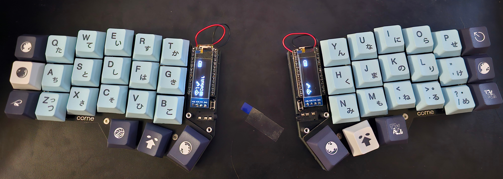
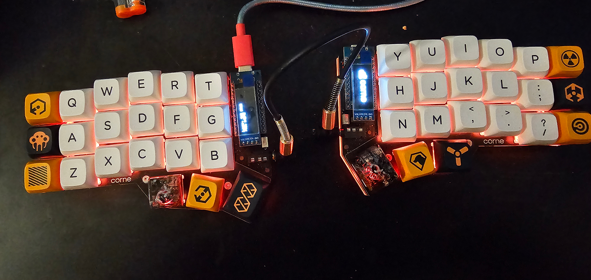

<h1 align="center">Frasier</h1>
<h3 align="center">SWE · Tech Enthusiast · Hardware Tinkerer</h3>

  
  
  

<table align="center">
  <tr>
    <td width="50%">🔭 <strong>Currently working on</strong> Building a Virtual Powerplant for Renewable Energy Devices</td>
    <td width="50%">🌱 <strong>Currently learning</strong>  C &nbsp;  Zig</td>
  </tr>
  <tr>
    <td>🎨 <strong>Current hobby</strong> Playing around with STM32 and FPGA microcontrollers</td>
    <td>⚡ <strong>Fun fact</strong> Vim &gt; Emacs &gt; VSCode</td>
  </tr>
</table>

> 💡 “Works on my machine” is my favorite debugging mantra. My IDE theme is dark mode, because light attracts bugs 🪲

> [!IMPORTANT]
> **Vim user btw.**

  
  

<h2>⌨️ My Coding Keyboards</h2>

  
  

> [!NOTE]
> Two finished keyboard builds, including Bluetooth.

<h2>🤝 Connect with me</h2>

<h2>🧰 Languages and Tools</h2>

<em>The toolbox behind the tinkering.</em>

                             

